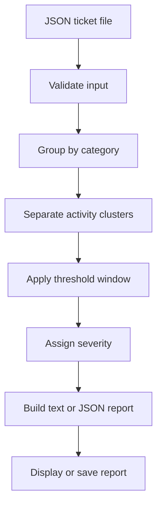

# Incident Signal

[](https://github.com/kay-freeman/incident-signal/actions/workflows/tests.yml)
[](CHANGELOG.md)

A configurable incident detection system that identifies emerging patterns across support tickets, separates distinct periods of related activity, assigns explainable severity levels, and produces integration-ready reports.

## The Problem

Support teams often receive the first signs of a service issue through individual customer tickets. When those tickets are handled separately, a developing incident can remain unnoticed until ticket volume becomes overwhelming.

Incident Signal groups tickets by issue category and evaluates their timestamps to identify unusual clusters. This gives support and operations teams an earlier signal that multiple customers may be experiencing the same problem.

The system can distinguish separate incidents involving the same issue category. For example, a login outage in the morning and another login outage later that afternoon are reported as two incidents instead of being combined or losing the smaller cluster.

Each detected incident receives a volume-based severity level. Reports can be displayed in the terminal, returned as structured JSON, or saved as files for downstream systems and operational handoffs.

## How It Works

The default detection rule flags a potential incident when:

- At least three tickets share the same category.
- Those tickets occur within a 30-minute window.

A quiet period longer than the configured window separates activity into distinct clusters. Each cluster must independently satisfy the detection threshold before it becomes an incident.



The included sample dataset contains 11 fictional tickets:

- Six login-failure reports between 9:02 AM and 9:21 AM
- Two unrelated support requests
- Three additional login-failure reports between 4:02 PM and 4:17 PM

Incident Signal identifies the morning and afternoon login clusters as two separate incidents, assigns them different severity levels, and ignores the unrelated tickets.

## Example Text Output

```text
Input file: data/sample_tickets.json
Analyzed 11 support tickets.
Detection rule: 3 tickets within 30 minutes.
Detected 2 potential incident(s):

Category: login_failure
Severity: high
Ticket count: 6
First seen: 2026-07-26 09:02:00
Last seen: 2026-07-26 09:21:00
Tickets: TKT-1001, TKT-1002, TKT-1003, TKT-1004, TKT-1005, TKT-1006

Category: login_failure
Severity: medium
Ticket count: 3
First seen: 2026-07-26 16:02:00
Last seen: 2026-07-26 16:17:00
Tickets: TKT-1009, TKT-1010, TKT-1011
```

## Example JSON Output

```json
{
  "input_file": "data/sample_tickets.json",
  "summary": {
    "tickets_analyzed": 11,
    "incidents_detected": 2
  },
  "detection_rule": {
    "threshold": 3,
    "window_minutes": 30
  },
  "incidents": [
    {
      "category": "login_failure",
      "severity": "high",
      "ticket_count": 6,
      "first_seen": "2026-07-26T09:02:00",
      "last_seen": "2026-07-26T09:21:00",
      "ticket_ids": [
        "TKT-1001",
        "TKT-1002",
        "TKT-1003",
        "TKT-1004",
        "TKT-1005",
        "TKT-1006"
      ]
    },
    {
      "category": "login_failure",
      "severity": "medium",
      "ticket_count": 3,
      "first_seen": "2026-07-26T16:02:00",
      "last_seen": "2026-07-26T16:17:00",
      "ticket_ids": [
        "TKT-1009",
        "TKT-1010",
        "TKT-1011"
      ]
    }
  ]
}
```

## Project Structure

```text
incident-signal/
├── .github/
│   └── workflows/
│       └── tests.yml
├── data/
│   └── sample_tickets.json
├── docs/
│   ├── architecture.md
│   └── system-requirements.md
├── src/
│   ├── __init__.py
│   ├── detection.py
│   ├── ingestion.py
│   ├── main.py
│   ├── models.py
│   └── reporting.py
├── tests/
│   ├── __init__.py
│   ├── test_detection.py
│   ├── test_ingestion.py
│   └── test_reporting.py
├── CHANGELOG.md
├── requirements.txt
└── README.md
```

## Documentation

Incident Signal includes systems-analysis documentation in addition to source code:

- [System Requirements](docs/system-requirements.md) — business problem, stakeholders, scope, data contract, business rules, functional requirements, nonfunctional requirements, acceptance criteria, and traceability
- [Architecture and Design](docs/architecture.md) — component responsibilities, runtime flow, detection architecture, design decisions, error handling, privacy, limitations, and extension points
- [Changelog](CHANGELOG.md) — version history, delivered capabilities, verification results, and privacy confirmation

## Design Decisions

### Deterministic Detection

The system uses transparent threshold rules instead of artificial intelligence. This makes every incident signal explainable and allows the detection behavior to be tested reliably.

### Sliding Time Window

A sliding window verifies that the required number of related tickets occurred within the configured timeframe. This is more flexible than dividing tickets into fixed time blocks.

### Multiple-Incident Detection

Tickets are grouped by category and sorted chronologically. A quiet gap longer than the configured detection window starts a new activity cluster.

Every activity cluster must independently contain a qualifying threshold window. This allows Incident Signal to:

- Detect separate incidents involving the same category.
- Prevent tickets from being counted in multiple incidents.
- Ignore slow activity that never reaches the required density.
- Preserve all tickets associated with a qualifying activity period.

### Explainable Severity Scoring

Severity is based on ticket volume relative to the configured detection threshold.

| Volume relative to threshold | Severity |
|---|---|
| At least 1× but less than 2× | `medium` |
| At least 2× but less than 3× | `high` |
| At least 3× | `critical` |

With the default threshold of three tickets:

| Ticket count | Severity |
|---:|---|
| 3–5 | `medium` |
| 6–8 | `high` |
| 9 or more | `critical` |

Because severity scales with the configured threshold, teams can change the detection rule without creating inconsistent severity behavior.

### Configurable System Behavior

Users can change the input file, ticket threshold, time window, report format, and output path without modifying source code.

### Separation of Concerns

Ingestion, detection, reporting, and command-line coordination are implemented as separate layers. Future input sources or output integrations can be introduced without replacing the detection engine.

### Machine-Readable Output

The `--format json` option produces a stable JSON structure that can be consumed by another application, webhook, dashboard, or incident-management workflow.

### Report Persistence

The optional `--output` setting saves text or JSON reports to a selected file path. Missing parent directories are created automatically.

### Input Validation

The ingestion layer verifies that:

- The selected input file exists.
- The file contains valid JSON.
- The top-level JSON value is a list.
- Every ticket is a JSON object.
- Every ticket contains the required fields.
- Required values contain non-empty text.
- Timestamps use a valid ISO format.
- Ticket IDs are unique.

Invalid input produces a clear operational error instead of being processed silently.

### Synthetic Data

All sample tickets are fictional. The repository contains no customer information, employer data, credentials, or proprietary support records.

## Running the Project

### 1. Clone the Repository

```bash
git clone https://github.com/kay-freeman/incident-signal.git
cd incident-signal
```

### 2. Create and Activate a Virtual Environment

```bash
python3 -m venv .venv
source .venv/bin/activate
```

### 3. Install the Test Dependency

```bash
python -m pip install -r requirements.txt
```

### 4. Run Incident Signal

Run the included sample data with the default settings:

```bash
python -m src.main
```

Select a JSON ticket file:

```bash
python -m src.main --input data/sample_tickets.json
```

Customize the ticket threshold and time window:

```bash
python -m src.main \
  --input data/sample_tickets.json \
  --threshold 4 \
  --window 45
```

Generate a JSON report:

```bash
python -m src.main \
  --input data/sample_tickets.json \
  --format json
```

Save a JSON report:

```bash
python -m src.main \
  --input data/sample_tickets.json \
  --format json \
  --output reports/incident-report.json
```

Save a readable text report:

```bash
python -m src.main \
  --input data/sample_tickets.json \
  --format text \
  --output reports/incident-report.txt
```

Available options:

- `--input` selects the JSON ticket file.
- `--threshold` controls the minimum number of related tickets required.
- `--window` controls the detection window in minutes.
- `--format` selects `text` or `json` output.
- `--output` optionally saves the report to a selected path.

View command-line help:

```bash
python -m src.main --help
```

### 5. Run the Automated Tests

```bash
pytest -v
```

## Error Handling

Incident Signal returns concise errors for:

- Missing input files
- Malformed JSON
- Invalid data structures
- Missing required fields
- Blank values
- Invalid timestamps
- Duplicate ticket IDs
- Invalid thresholds or time windows
- Unsupported output formats
- Report-writing failures

Example:

```text
Error: Input file not found: data/does_not_exist.json
```

## Test Coverage

The automated suite contains 18 tests covering the detection, ingestion, and reporting layers.

The tests verify that the system:

- Detects a qualifying ticket cluster.
- Detects multiple incidents in the same category.
- Prevents slow activity from creating a false incident.
- Assigns medium, high, and critical severity levels.
- Ignores activity below the configured threshold.
- Rejects invalid detection settings.
- Loads and validates JSON ticket data.
- Rejects malformed or incomplete inputs.
- Detects duplicate ticket IDs.
- Builds readable text reports.
- Builds structured JSON reports containing severity.
- Handles empty incident results.
- Saves reports and creates missing parent directories.

## Continuous Integration

GitHub Actions automatically installs the project dependencies and runs all 18 tests on every push and pull request.

The test-status badge at the top of this README reflects the latest workflow result from the `main` branch.

## Version 1.0 Status

Version 1.0 is feature-complete.

Delivered capabilities include:

- Validated JSON ingestion
- Configurable incident detection
- Multiple same-category incidents
- False-positive prevention
- Explainable severity scoring
- Text and JSON reporting
- Saved report files
- Automated testing
- Continuous integration
- Requirements traceability
- Architecture documentation
- Synthetic public demonstration data

See the [Changelog](CHANGELOG.md) for the complete version history.

## Future Enhancements

- Ingest CSV exports and webhook payloads.
- Connect to a live help-desk API.
- Send Slack or Jira incident notifications.
- Visualize ticket volume and incident timelines.
- Persist incident state between runs.
- Add timezone normalization.
- Incorporate additional severity factors.

## Skills Demonstrated

- Requirements elicitation and translation
- Systems analysis
- Business-rule modeling
- Functional and nonfunctional requirements
- Acceptance criteria
- Requirements traceability
- Architecture documentation
- Design-decision documentation
- Data modeling
- Configurable system design
- Input validation
- Error handling
- Rule-based automation
- Time-window analysis
- Multiple-incident detection
- Explainable severity scoring
- False-positive prevention
- Separation of concerns
- Machine-readable reporting
- Report persistence
- Python development
- Automated testing
- Continuous integration with GitHub Actions
- Technical documentation
- Integration-ready design