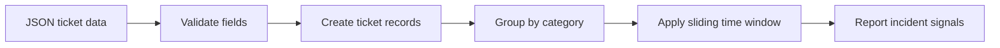

# Incident Signal

A rule-based incident detection system that identifies emerging patterns across support tickets before isolated reports become a larger operational problem.

## The Problem

Support teams often receive the first signs of a service issue through individual customer tickets. When those tickets are handled separately, a developing incident can remain unnoticed until ticket volume becomes overwhelming.

Incident Signal groups tickets by issue category and evaluates their timestamps to identify unusual clusters. This gives support and operations teams an earlier signal that multiple customers may be experiencing the same problem.

## How It Works

The default detection rule flags a potential incident when:

- At least three tickets share the same category.
- Those tickets occur within a 30-minute window.



The included sample dataset contains four login-failure reports within 19 minutes. Incident Signal detects them as one potential incident while ignoring unrelated billing and profile tickets.

## Example Output

```text
Analyzed 6 support tickets.
Detection rule: 3 tickets within 30 minutes.
Detected 1 potential incident(s):

Category: login_failure
Ticket count: 4
First seen: 2026-07-26 09:02:00
Last seen: 2026-07-26 09:21:00
Tickets: TKT-1001, TKT-1002, TKT-1003, TKT-1004
```

## Project Structure

```text
incident-signal/
├── data/
│   └── sample_tickets.json
├── src/
│   ├── __init__.py
│   ├── detection.py
│   ├── ingestion.py
│   ├── main.py
│   └── models.py
├── tests/
│   ├── __init__.py
│   └── test_detection.py
├── requirements.txt
└── README.md
```

## Design Decisions

### Deterministic Detection

The first version uses transparent threshold rules instead of artificial intelligence. This makes every incident signal explainable and allows the detection behavior to be tested reliably.

### Sliding Time Window

A sliding window identifies the largest qualifying cluster of tickets for each issue category. This is more flexible than dividing tickets into fixed time blocks.

### Configurable Business Rules

Detection thresholds can be changed through command-line options without modifying the source code. This allows the same system to support teams with different ticket volumes and escalation requirements.

### Input Validation

The ingestion layer verifies that ticket data is a list and that every ticket contains the required fields:

- `ticket_id`
- `created_at`
- `category`
- `summary`

Invalid data produces a clear error instead of being processed silently.

### Synthetic Data

All sample tickets are fictional. The repository contains no customer information, employer data, or proprietary support records.

## Running the Project

### 1. Clone the Repository

```bash
git clone https://github.com/kay-freeman/incident-signal.git
cd incident-signal
```

### 2. Create and Activate a Virtual Environment

```bash
python3 -m venv .venv
source .venv/bin/activate
```

### 3. Install the Test Dependency

```bash
python -m pip install -r requirements.txt
```

### 4. Run Incident Signal

Run the system with its default rule of three related tickets within 30 minutes:

```bash
python -m src.main
```

Customize the rule with command-line options:

```bash
python -m src.main --threshold 4 --window 45
```

- `--threshold` controls the minimum number of related tickets required.
- `--window` controls the detection window in minutes.

View all available options:

```bash
python -m src.main --help
```

### 5. Run the Automated Tests

```bash
pytest -v
```

## Test Coverage

The automated test suite verifies that the system:

- Detects a qualifying ticket cluster.
- Ignores categories below the ticket threshold.
- Ignores tickets outside the configured time window.
- Rejects an invalid detection threshold.

## Future Enhancements

- Accept alternative input files through command-line options.
- Ingest CSV exports and webhook payloads.
- Detect multiple incidents within the same category.
- Generate structured JSON incident reports.
- Add severity scoring.
- Send alerts to incident-management or communication systems.
- Visualize ticket volume and detected incident timelines.

## Skills Demonstrated

- Requirements translation
- Systems analysis
- Data modeling
- Input validation
- Configurable business rules
- Rule-based automation
- Time-window analysis
- Python development
- Automated testing
- Technical documentation