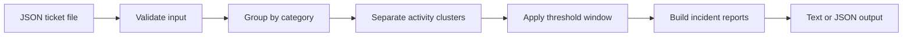

# Incident Signal

[](https://github.com/kay-freeman/incident-signal/actions/workflows/tests.yml)

A rule-based incident detection system that identifies emerging patterns across support tickets before isolated reports become a larger operational problem.

## The Problem

Support teams often receive the first signs of a service issue through individual customer tickets. When those tickets are handled separately, a developing incident can remain unnoticed until ticket volume becomes overwhelming.

Incident Signal groups tickets by issue category and evaluates their timestamps to identify unusual clusters. This gives support and operations teams an earlier signal that multiple customers may be experiencing the same problem.

The system can also distinguish separate incidents involving the same issue category. For example, a login outage in the morning and another login outage later that afternoon are reported as two incidents instead of being combined or losing the smaller cluster.

## How It Works

The default detection rule flags a potential incident when:

- At least three tickets share the same category.
- Those tickets occur within a 30-minute window.

A quiet period longer than the configured window separates activity into distinct clusters. Each cluster must independently satisfy the detection threshold before it becomes an incident.



The included sample dataset contains nine fictional tickets:

- Four login-failure reports between 9:02 AM and 9:21 AM
- Two unrelated support requests
- Three additional login-failure reports between 4:02 PM and 4:17 PM

Incident Signal identifies the morning and afternoon login clusters as two separate incidents while ignoring the unrelated tickets.

## Example Text Output

```text
Input file: data/sample_tickets.json
Analyzed 9 support tickets.
Detection rule: 3 tickets within 30 minutes.
Detected 2 potential incident(s):

Category: login_failure
Ticket count: 4
First seen: 2026-07-26 09:02:00
Last seen: 2026-07-26 09:21:00
Tickets: TKT-1001, TKT-1002, TKT-1003, TKT-1004

Category: login_failure
Ticket count: 3
First seen: 2026-07-26 16:02:00
Last seen: 2026-07-26 16:17:00
Tickets: TKT-1007, TKT-1008, TKT-1009
```

## Example JSON Output

```json
{
  "input_file": "data/sample_tickets.json",
  "summary": {
    "tickets_analyzed": 9,
    "incidents_detected": 2
  },
  "detection_rule": {
    "threshold": 3,
    "window_minutes": 30
  },
  "incidents": [
    {
      "category": "login_failure",
      "ticket_count": 4,
      "first_seen": "2026-07-26T09:02:00",
      "last_seen": "2026-07-26T09:21:00",
      "ticket_ids": [
        "TKT-1001",
        "TKT-1002",
        "TKT-1003",
        "TKT-1004"
      ]
    },
    {
      "category": "login_failure",
      "ticket_count": 3,
      "first_seen": "2026-07-26T16:02:00",
      "last_seen": "2026-07-26T16:17:00",
      "ticket_ids": [
        "TKT-1007",
        "TKT-1008",
        "TKT-1009"
      ]
    }
  ]
}
```

## Project Structure

```text
incident-signal/
├── .github/
│   └── workflows/
│       └── tests.yml
├── data/
│   └── sample_tickets.json
├── src/
│   ├── __init__.py
│   ├── detection.py
│   ├── ingestion.py
│   ├── main.py
│   ├── models.py
│   └── reporting.py
├── tests/
│   ├── __init__.py
│   ├── test_detection.py
│   ├── test_ingestion.py
│   └── test_reporting.py
├── requirements.txt
└── README.md
```

## Design Decisions

### Deterministic Detection

The first version uses transparent threshold rules instead of artificial intelligence. This makes every incident signal explainable and allows the detection behavior to be tested reliably.

### Sliding Time Window

A sliding window verifies that the required number of related tickets occurred within the configured timeframe. This is more flexible than dividing tickets into fixed time blocks.

### Multiple-Incident Detection

Tickets are first grouped by category and sorted chronologically. A quiet gap longer than the configured detection window starts a new activity cluster.

Every activity cluster must independently contain a qualifying threshold window. This allows Incident Signal to:

- Detect separate incidents involving the same category.
- Prevent tickets from being counted in multiple incidents.
- Ignore slow activity that never reaches the required density.
- Preserve all tickets associated with a qualifying activity period.

### Configurable Business Rules

Detection thresholds can be changed through command-line options without modifying the source code. This allows the same system to support teams with different ticket volumes and escalation requirements.

### Configurable Input

Users can analyze different JSON ticket files through the `--input` option. The detection engine is not tied exclusively to the included sample dataset.

### Separate Reporting Layer

Report generation is separated from ingestion and detection. This allows incident results to be presented in different formats without changing the underlying business rules.

### Machine-Readable Output

The `--format json` option produces a stable JSON structure that can be consumed by another application, webhook, dashboard, or incident-management workflow.

### Input Validation

The ingestion layer verifies that:

- The selected input file exists.
- The file contains valid JSON.
- The top-level JSON value is a list.
- Every ticket is a JSON object.
- Every ticket contains the required fields.
- Required values contain non-empty text.
- Timestamps use a valid ISO format.
- Ticket IDs are unique.

Invalid input produces a clear operational error instead of being processed silently.

### Synthetic Data

All sample tickets are fictional. The repository contains no customer information, employer data, or proprietary support records.

## Running the Project

### 1. Clone the Repository

```bash
git clone https://github.com/kay-freeman/incident-signal.git
cd incident-signal
```

### 2. Create and Activate a Virtual Environment

```bash
python3 -m venv .venv
source .venv/bin/activate
```

### 3. Install the Test Dependency

```bash
python -m pip install -r requirements.txt
```

### 4. Run Incident Signal

Run the included sample data with the default settings:

```bash
python -m src.main
```

Select a JSON ticket file:

```bash
python -m src.main --input data/sample_tickets.json
```

Customize the ticket threshold and time window:

```bash
python -m src.main \
  --input data/sample_tickets.json \
  --threshold 4 \
  --window 45
```

Generate a machine-readable JSON report:

```bash
python -m src.main \
  --input data/sample_tickets.json \
  --format json
```

Available options:

- `--input` selects the JSON ticket file.
- `--threshold` controls the minimum number of related tickets required.
- `--window` controls the detection window in minutes.
- `--format` selects `text` or `json` output.

View command-line help:

```bash
python -m src.main --help
```

### 5. Run the Automated Tests

```bash
pytest -v
```

## Error Handling

If the selected file does not exist, Incident Signal returns a concise error:

```text
Error: Input file not found: data/does_not_exist.json
```

Malformed JSON, missing fields, invalid timestamps, blank values, duplicate ticket IDs, invalid detection settings, and unsupported output formats are also rejected with clear messages.

## Test Coverage

The automated suite contains 15 tests covering the detection, ingestion, and reporting layers.

The tests verify that the system:

- Detects a qualifying ticket cluster.
- Detects multiple incidents in the same category.
- Prevents slow activity from creating a false incident.
- Ignores categories below the configured threshold.
- Ignores tickets outside the configured time window.
- Rejects invalid detection settings.
- Loads valid JSON ticket data.
- Rejects an invalid top-level data structure.
- Rejects missing required fields.
- Rejects invalid timestamps.
- Rejects duplicate ticket IDs.
- Rejects malformed JSON.
- Reports missing input files.
- Produces a structured JSON incident report.
- Produces a valid JSON report when no incidents are detected.

## Continuous Integration

GitHub Actions automatically installs the project dependencies and runs all 15 tests on every push and pull request. This provides immediate feedback when a change breaks existing detection, ingestion, or reporting behavior.

The test-status badge at the top of this README reflects the latest workflow result from the `main` branch.

## Future Enhancements

- Ingest CSV exports and webhook payloads.
- Add severity scoring.
- Save reports directly to output files.
- Send alerts to incident-management or communication systems.
- Visualize ticket volume and detected incident timelines.

## Skills Demonstrated

- Requirements translation
- Systems analysis
- Data modeling
- Configurable system design
- Input validation
- Error handling
- Rule-based automation
- Time-window analysis
- Multiple-incident detection
- False-positive prevention
- Separation of concerns
- Machine-readable reporting
- Python development
- Automated testing
- Continuous integration with GitHub Actions
- Technical documentation
- Integration-ready design