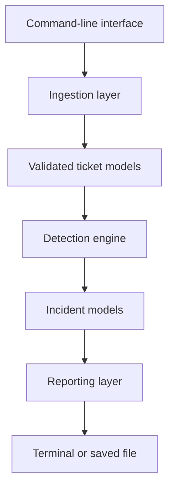
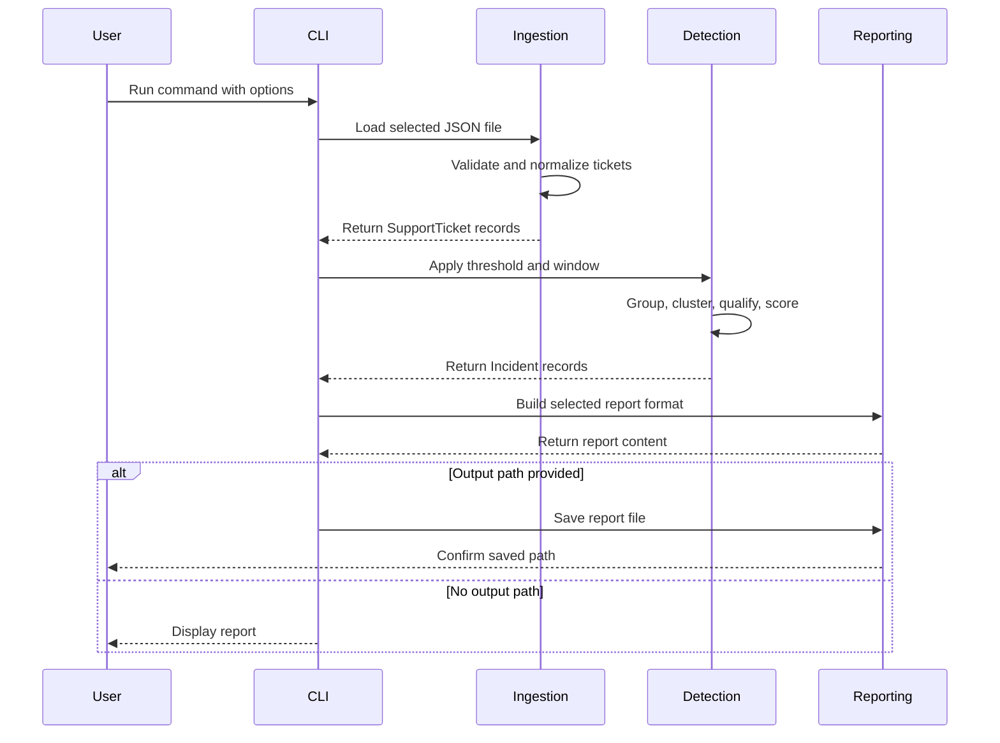
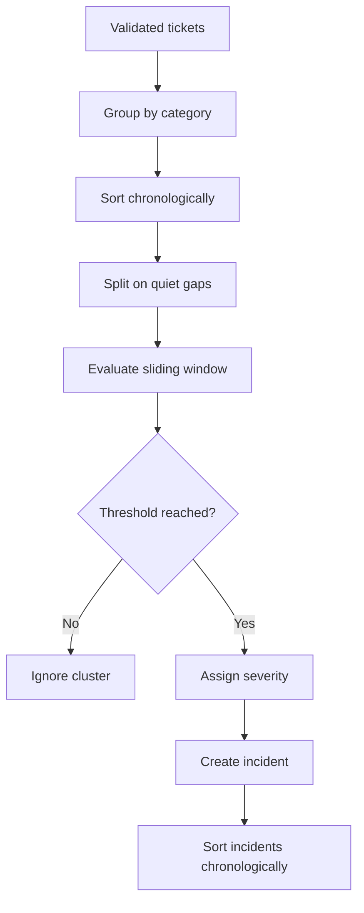
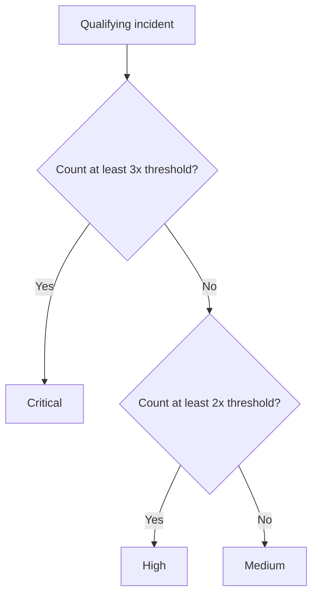
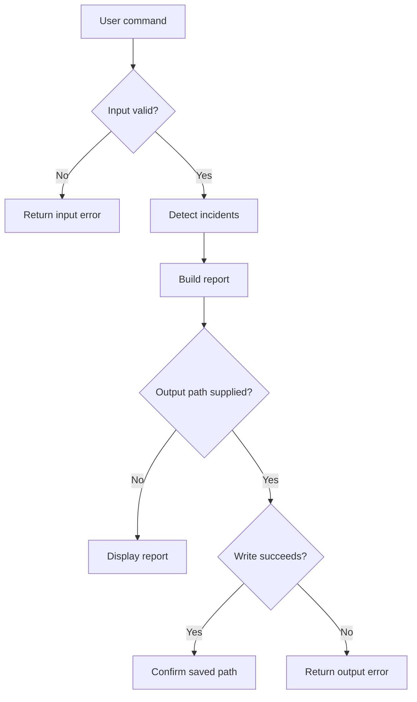

# Incident Signal — Architecture and Design

## Document Information

| Field | Value |
|---|---|
| System | Incident Signal |
| Version | 1.0 |
| Architecture style | Layered command-line application |
| Runtime | Python 3 |
| Primary interface | Command line |
| Input | JSON ticket file |
| Output | Text or JSON report |

## 1. Architecture Overview

Incident Signal uses a layered architecture that separates input processing, business rules, reporting, and user interaction.



This separation allows each layer to change independently. For example, CSV or webhook ingestion could be introduced without rewriting the detection engine.

## 2. Component Responsibilities

| Component | File | Responsibility |
|---|---|---|
| Command-line interface | `src/main.py` | Parse user options, coordinate processing, handle operational errors, and select report behavior |
| Data models | `src/models.py` | Define immutable support-ticket and incident records |
| Ingestion layer | `src/ingestion.py` | Read JSON, validate incoming data, normalize values, and create ticket models |
| Detection engine | `src/detection.py` | Group tickets, separate activity, apply threshold rules, detect incidents, and assign severity |
| Reporting layer | `src/reporting.py` | Build text and JSON reports and save report files |
| Sample dataset | `data/sample_tickets.json` | Demonstrate expected input and system behavior |
| Detection tests | `tests/test_detection.py` | Verify clustering, false-positive prevention, multiple incidents, and severity |
| Ingestion tests | `tests/test_ingestion.py` | Verify valid and invalid input behavior |
| Reporting tests | `tests/test_reporting.py` | Verify text, JSON, empty, and saved-report behavior |
| CI workflow | `.github/workflows/tests.yml` | Run the complete automated test suite after pushes and pull requests |

## 3. Runtime Data Flow



## 4. Data Models

### SupportTicket

```text
SupportTicket
├── ticket_id: str
├── created_at: datetime
├── category: str
└── summary: str
```

`SupportTicket` is immutable after creation. This prevents later processing stages from silently altering validated source data.

### Incident

```text
Incident
├── category: str
├── severity: str
├── ticket_count: int
├── first_seen: datetime
├── last_seen: datetime
└── ticket_ids: tuple[str, ...]
```

`Incident` is also immutable. The record represents the final result of applying the configured business rules to one qualifying activity cluster.

## 5. Detection Architecture

The detector processes each category independently.



### Detection Steps

1. Group all tickets by category.
2. Sort each category chronologically.
3. Start a new activity cluster after a quiet gap longer than the configured window.
4. Apply a sliding window inside each activity cluster.
5. Confirm that at least the configured threshold occurs inside the configured window.
6. Ignore activity clusters that never qualify.
7. Calculate severity from the cluster’s total ticket volume.
8. Convert each qualifying cluster into an immutable incident record.
9. Sort all detected incidents by their first timestamp.

## 6. Activity Clustering Decision

A quiet gap longer than the configured time window separates incidents.

Example with a 30-minute window:

```text
09:02 ─ 09:08 ─ 09:14 ─ 09:21     16:02 ─ 16:09 ─ 16:17
└──── Morning activity cluster ────┘     └─ Afternoon cluster ─┘
```

The gap between 9:21 AM and 4:02 PM exceeds 30 minutes, so the two periods are evaluated independently.

This prevents the detector from:

- Returning only the largest incident
- Combining unrelated activity periods
- Counting one ticket in multiple incidents

## 7. False-Positive Prevention

Activity clustering alone is not sufficient to create an incident.

Consider these same-category tickets:

```text
09:00 → 09:25 → 09:50
```

Each consecutive gap is 25 minutes, so they remain part of one activity cluster. However, there are never three tickets inside a single 30-minute window.

The cluster is therefore rejected.

This two-stage rule provides both:

1. Activity-session separation
2. Threshold-density validation

## 8. Severity Architecture

Severity is deterministic and proportional to the configured threshold.



### Why Relative Severity Was Chosen

A fixed severity table would become inconsistent when the user changes the detection threshold.

For example:

- A six-ticket incident is `high` when the threshold is three.
- The same six-ticket incident is only `medium` when the threshold is five.

Relative scoring ensures that severity remains aligned with each team’s definition of unusual volume.

## 9. Reporting Architecture

The reporting layer supports two presentation formats.

### Text Report

Designed for:

- Terminal review
- Human-readable handoffs
- Saved incident summaries
- Troubleshooting and demonstrations

### JSON Report

Designed for:

- Webhooks
- Slack or Jira integrations
- Dashboard ingestion
- Scheduled workflows
- Programmatic analysis
- Report archiving

Both formats receive the same incident records and detection configuration. Reporting does not recalculate or modify incident results.

## 10. File Persistence

When the user provides `--output`:

1. The selected report is built in memory.
2. The output path is converted to a `Path`.
3. Missing parent directories are created.
4. The report is written using UTF-8.
5. The saved path is returned to the command-line layer.
6. The user receives a confirmation message.

If writing fails, the command-line layer returns a concise operational error.

## 11. Error Flow



Errors are handled at the command-line boundary so internal modules can raise standard Python exceptions while users receive readable messages.

## 12. Design Decisions

### ADR-001: Use Deterministic Rules

**Decision:** Use configurable threshold and time-window rules.

**Reason:** Detection results must be explainable, testable, and appropriate for a systems-analysis portfolio.

**Alternative considered:** Machine-learning or natural-language classification.

**Why deferred:** It would add uncertainty and complexity before the operational rules are validated.

### ADR-002: Use Immutable Data Models

**Decision:** Define tickets and incidents as frozen data classes.

**Reason:** Validated records should not change unexpectedly between system layers.

### ADR-003: Separate Ingestion from Detection

**Decision:** The detector accepts ticket models rather than reading files directly.

**Reason:** Future input sources can be added without changing the business rules.

### ADR-004: Separate Reporting from Detection

**Decision:** The detector returns incident models and does not format output.

**Reason:** Text, JSON, file, webhook, or dashboard output can evolve independently.

### ADR-005: Use Relative Severity

**Decision:** Calculate severity using multiples of the configured threshold.

**Reason:** Severity remains internally consistent when teams change their detection settings.

### ADR-006: Use Synthetic Demonstration Data

**Decision:** Store only fictional ticket records.

**Reason:** The public repository must not expose customer, employer, or proprietary information.

### ADR-007: Use GitHub Actions for Continuous Integration

**Decision:** Run the entire test suite on every push and pull request.

**Reason:** Automated validation provides immediate regression feedback and visible repository health.

## 13. Security and Privacy

Version 1.0 does not require credentials, network access, or external service connections.

Security and privacy controls include:

- No embedded secrets
- No customer information
- No employer data
- No proprietary ticket records
- Local file processing
- Read-only treatment of source ticket files
- Explicit output paths
- Synthetic public demonstration data

Future live integrations would require additional controls for authentication, authorization, secret storage, retention, and audit logging.

## 14. Performance and Scalability

Version 1.0 processes tickets in memory.

Major operations include:

- Grouping tickets by category
- Sorting category tickets chronologically
- Scanning activity clusters with sliding windows

This approach is appropriate for demonstration datasets and moderate local files.

Future high-volume versions could introduce:

- Streaming ingestion
- Incremental incident state
- Persistent storage
- Queue-based processing
- Indexed category and timestamp queries
- Distributed event processing

## 15. Extension Points

The architecture supports future additions without replacing the detection engine.

| Future capability | Expected extension |
|---|---|
| CSV ingestion | Add a CSV ingestion adapter |
| Webhook ingestion | Convert payloads into `SupportTicket` models |
| Help-desk API | Add an authenticated ticket-source adapter |
| Slack alerts | Send JSON report data to a Slack integration |
| Jira incidents | Map incident records into Jira issue fields |
| Dashboard | Read JSON output or expose incident data through an API |
| Database storage | Persist validated tickets and incident records |
| Category classification | Add a preprocessing classifier before detection |
| Additional severity factors | Extend the severity policy without changing ingestion |

## 16. Testing Strategy

The automated suite covers three layers:

### Detection Tests

- Qualifying incident detection
- Below-threshold behavior
- Out-of-window behavior
- Invalid configuration
- Multiple same-category incidents
- False-positive prevention
- Medium, high, and critical severity

### Ingestion Tests

- Valid ticket loading
- Invalid top-level structure
- Missing required fields
- Invalid timestamps
- Duplicate ticket IDs
- Malformed JSON
- Missing files

### Reporting Tests

- Human-readable text output
- Structured JSON output
- Empty incident results
- File creation and persistence

GitHub Actions runs all 18 tests after every push and pull request.

## 17. Deployment Model

Version 1.0 is a local command-line application.

```text
User workstation
├── Python virtual environment
├── Incident Signal repository
├── Input JSON file
└── Optional saved report files
```

No server, database, container, or cloud account is required.

## 18. Known Limitations

- Input is limited to JSON files.
- Categories must already be assigned.
- Severity is based only on ticket volume.
- Timestamps do not currently enforce a timezone policy.
- Incident state is not persisted between runs.
- Reports are not automatically transmitted.
- The system does not determine incident resolution.
- Large-scale performance has not been benchmarked.

These limitations are accepted for version 1.0 and documented as future extension opportunities.